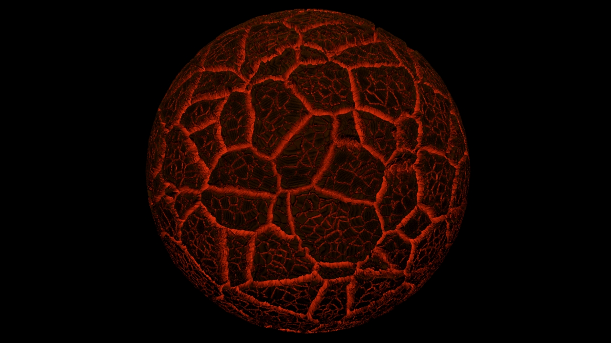

In the subject Physically Based Rendering, the task was to create an Arnold material.
I decided to make embers out of charcoal.

It was important that the embers had three characteristics.
- Large areas to represent the large pieces of charcoal. For this purpose, a cellular node and a smoke node were used as distortion in order not to get too smooth edges.
- Within these large areas, smaller areas should still be visible. The same nodes were used as before, only the tiling was increased.
- A wood dimension that was revealed by the Advanced Wood Map.

The file for the material can be found [here](PBR.max).
