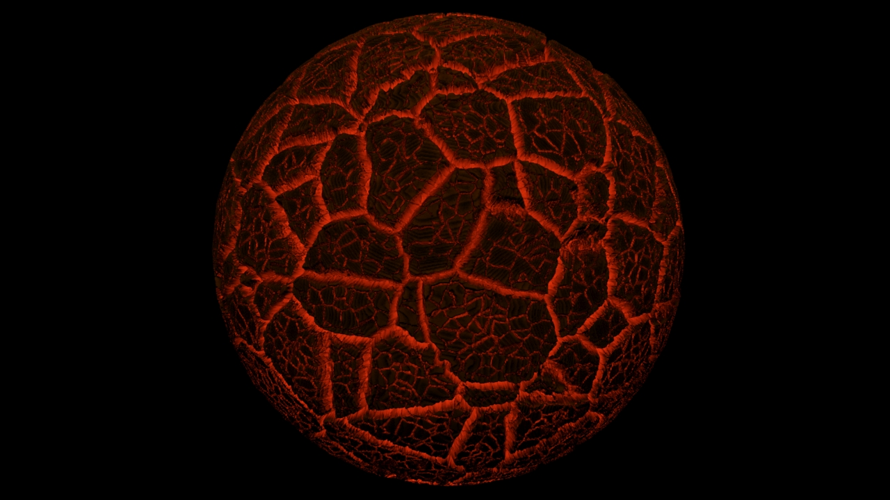

# 🔥 Physically Based Rendering (PBR)
*Procedural material design using Arnold for Maya.*

In this advanced rendering course, I focused on creating a complex, multi-layered **Charcoal Ember** material.

### 🛠️ Technical Implementation:
To achieve a realistic "burning" effect, I implemented a shader with three distinct procedural characteristics:
*   **Macro Structure:** Cellular nodes combined with smoke-based distortion nodes to create the rough, organic edges of large charcoal chunks.
*   **Micro Detail:** High-frequency tiling of the distortion nodes within the larger segments to simulate internal cracking and heat intensity.
*   **Internal Grain:** Integration of an *Advanced Wood Map* to reveal the underlying wood fiber structure where the charcoal has partially burned away.

---

### 📂 Resources
*   [**Material File (.max)**](PBR.max)

---

### [← Back to Portfolio](portfolio.md) | [Back to Home](index.md)
